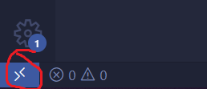

# Development Environment Set Up

This document outlines how to set up the development environment. It *should* work for every OS, but it's only been tested on Windows. By standardizing the development environment, I'm hoping we can avoid things like "well it works on my machine!!!" as much as possible. 

There are alternative development environments you can use, like managing Docker yourself and developing directly in the command line (🤮), or installing Ubuntu 20.04 + ROS directly onto your computer, but please follow the instructions in this document unless you're sure you know what you're doing or are just interested in becoming more fluent in Docker/Linux/ROS (happy to help if so). IMO, the environment described in this doc is the most pain-free way to set up and develop ROS code that I've seen. 

Please feel free to message me on Discord (HaresOnGin#8786) with any errors/questions or if you're just curious about exactly what's going on here. 

## Things to install

- **Docker** - Follow the [Docker installation instructions](https://docs.docker.com/get-docker/) for your OS. Make sure it's installed properly by running `docker` in your terminal. 

- **VS Code** - Even if you normally use a different IDE, the development environment we'll be using *requires* VS Code + the following two extensions:
    - [Dev Containers](https://marketplace.visualstudio.com/items?itemName=ms-vscode-remote.remote-containers) - Allows you to open this repo in a development container (as defined in [`Dockerfile`](../Dockerfile) and [`.devcontainer`](../.devcontainer/devcontainer.json)) without having to build or pull the Docker image from anywhere yourself. Super handy because you can then use all of VS Code's features normally (including whatever other extensions you normally use). This is the main reason we're using VS Code, though if you're familiar with any other IDE that has this kind of functionality, feel free to use that instead. 
    - [Docker](https://marketplace.visualstudio.com/items?itemName=ms-azuretools.vscode-docker) - TBH, I don't know if we *need* this extension but it'll be nice QoL to have whenever we want to make changes to the Dockerfile. 

## Using the Development Environment

1. Open this repo in VS Code (either with **File** -> **Open Folder** or `code <folder>` on the command line)

2. On the bottom left hand corner under the settings button, click the box with the two arrows opposing each other 



3. Select **Reopen in Container** in the list of options that pops up. The first time you do this, it will take a while because it has to pull the base Docker image down. It'll open pretty fast after the first time. You'll know it's worked once the bottom left corner says **Dev Container: Brooklyn Project** and the terminal pops up with `root` as the user.

Good job! You are now developing on a fully fledged ROS + Ubuntu 20.04 container. 

## More setup in your dev container (only needs to be done once)

You do need to configure a couple of things before you can make any `git` commits. Just run the following two lines with your information.

```
git config --global user.name "firstName lastName"
git config --global user.email "email tied to your github account"
```

Also, I ran into this weird bug (guessing it's some weird windows thing) where my files were all shown as modified in `git` even though I didn't change anything. It turns out it's something dumb with the new line characters being different between the OS's. If you see this (either in VS Code or by running `git diff`), I fixed it with the following command, though [some people](https://stackoverflow.com/questions/62724723/git-in-visual-studio-code-says-file-is-modified-even-when-there-is-no-change) say that they fixed it by setting it to `false` lol. 

```
git config --global core.autocrlf true
```

### Optional (but highly recommended)
Since this is a private repository, you'll have to login to Github every time you `git pull` or `git push`, which gets *really* annoying. I tried to set up `ssh` in the container to avoid this, but I'm not sure if I did it properly (works for me but idk if it's just because it's my account or VS Code magic or something). If it doesn't work for you just `git push` however you're used to doing it, though I highly recommend [setting up `ssh` keys](https://docs.github.com/en/authentication/connecting-to-github-with-ssh/generating-a-new-ssh-key-and-adding-it-to-the-ssh-agent) so you don't have to enter your username and personal access token every time you `pull` or `push`. If you do set up `ssh` keys and didn't clone this repo with `ssh` initially, you'll have to update the `origin` remote-url:

```
git remote set-url origin git@github.com:brooklyn-project/brooklyn-project.git
```
